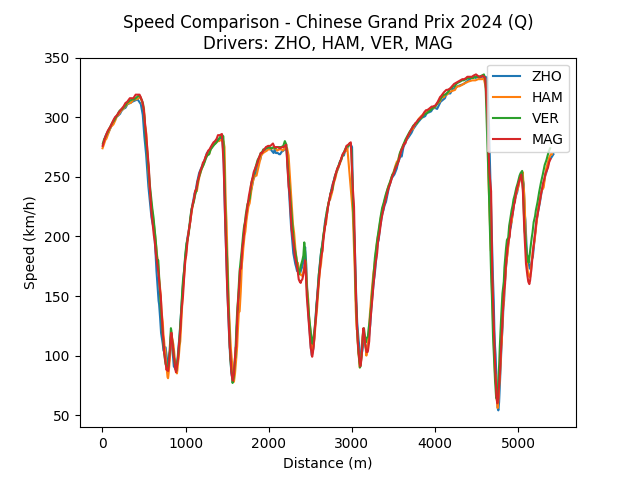

# F1 Lap Comparison Tool


Welcome to the unofficial **F1 Lap Comparison Tool**, powered by the [fastf1](https://theoehrly.github.io/Fast-F1/) Python library!

This console-based tool allows you to compare telemetry data like speed, throttle, brake, and gear across different drivers in a selected Formula 1 Grand Prix session.

---
## Features

- Select any F1 season year between 2018 and 2024
- Choose from all Grand Prix events in the selected year
- Pick session types: Free Practice 1 (FP1), Free Practice 2 (FP2), Qualifying (Q), or Race (R)
- Compare telemetry data (Speed, Throttle, Brake, Gear) between multiple drivers
- Visualize telemetry data with clear plots

---

## Installation

1. Clone the repository:
   ```bash
   git clone https://github.com/JosiahYeater/f1-lap-comparison
   ```
2. Navigate to the tool:
    ```bash
    cd f1-lap-comparison
    ```
3. Install the required Python packages:
   ```bash
   pip install fastf1 matplotlib
   ```
---

## Usage

Run the tool via the command line:

```bash
python lap_compare.py
```
Follow the on-screen prompts to:

- Select the year
- Pick the Grand Prix
- Choose the session type
- Select the drivers to compare
- Pick the telemetry data metric

A plot will be displayed comparing the chosen telemetry data for the selected drivers.



*Screenshot of telemetry comparison plot output*

---

## Acknowledgments

- fastf1 — Python library for accessing F1 data
- Matplotlib — Python plotting library
- Thanks to ChatGPT (OpenAI) for help with Python structuring and documentation

---

## License

This project is licensed under the MIT License. See the [LICENSE](LICENSE) file for details.

---

## Contact

Created by Josiah Yeater.

Feel free to open issues or submit pull requests!